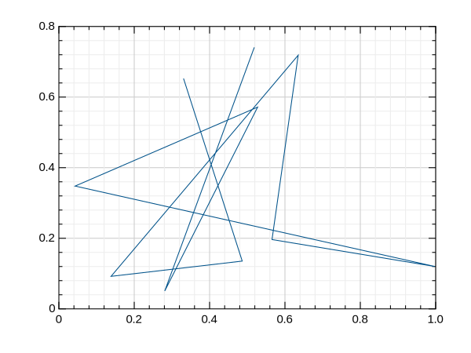

# ubuntu

https://hub.docker.com/r/juliacn/ubuntu/tags/

支持GR的JuliaCN ubuntu docker images (juliacn/ubuntu:julia.gr)


# 使用方法

```
$ docker run --rm -it juliacn/ubuntu:julia.gr
               _
   _       _ _(_)_     |  Documentation: https://docs.julialang.org
  (_)     | (_) (_)    |
   _ _   _| |_  __ _   |  Type "?" for help, "]?" for Pkg help.
  | | | | | | |/ _` |  |
  | | |_| | | | (_| |  |  Version 1.0.0 (2018-08-08)
 _/ |\__'_|_|_|\__'_|  |  Official https://julialang.org/ release
|__/                   |

julia> using GR

julia> ENV["GKSwstype"]="svg" # to avoid GUI
"svg"

julia> plot(rand(10), rand(10))

julia> savefig("test.svg")

shell> head test.svg
<?xml version="1.0" encoding="utf-8"?>
<svg xmlns="http://www.w3.org/2000/svg" xmlns:xlink="http://www.w3.org/1999/xlink" width="600" height="450" viewBox="0 0 600 450">
<defs>
  <clipPath id="clip2400">
    <rect x="75" y="33" width="481" height="361"/>
  </clipPath>
</defs>
<defs>
  <clipPath id="clip2401">
    <rect x="0" y="0" width="600" height="450"/>

julia> 

```



[docker入门](https://docs.docker.com/get-started/)
